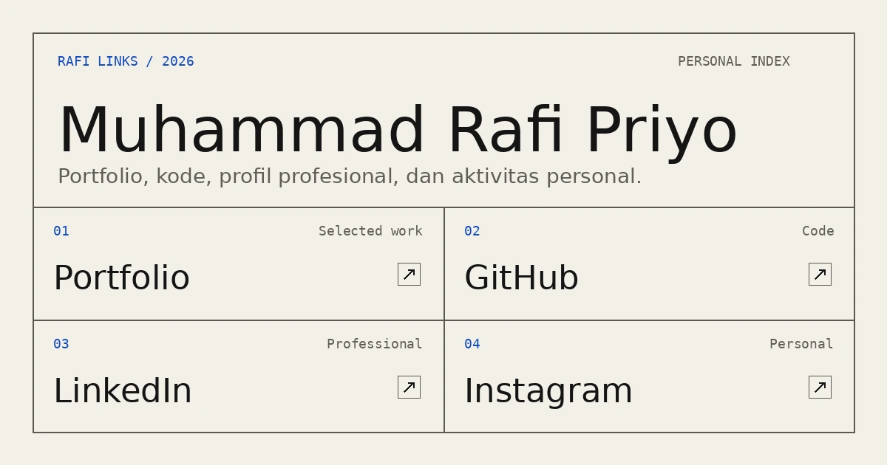

# Rafi Links

Rafi Links adalah personal index milik **Muhammad Rafi Priyo**—mahasiswa, full-stack developer, dan cybersecurity enthusiast yang mendalami web, AI, IoT, jaringan, serta keamanan siber.

Website ini merangkum portfolio, source code, project, dan profil profesional dalam satu halaman yang ringan:

**[muhrafi-fsdev.github.io/rafi-links](https://muhrafi-fsdev.github.io/rafi-links/)**

## Security

Repository menggunakan CSP, pemeriksaan integritas statis, CodeQL, dan Dependabot untuk membantu mendeteksi perubahan berisiko. Pelaporan kerentanan mengikuti panduan di [SECURITY.md](SECURITY.md).
